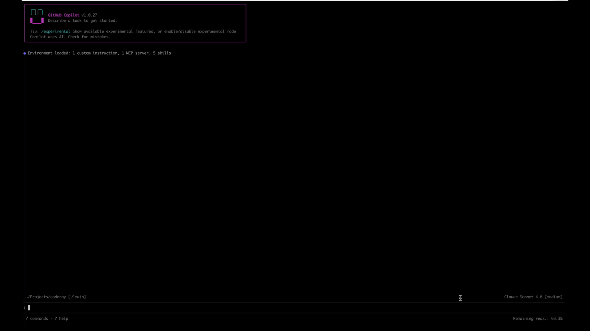
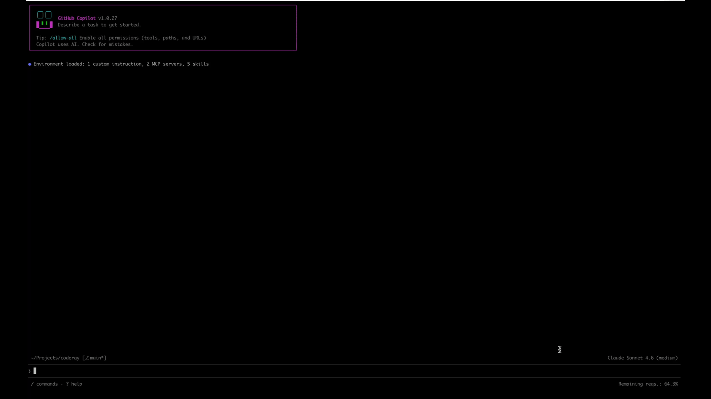

# CodeRay – Agents read lines, not file dumps

[](https://pypi.org/project/coderay/)
[](LICENSE)
[](https://github.com/bogdan-copocean/coderay/actions/workflows/ci.yml)

Agents read whole files by default – most of it irrelevant. That burns tokens, floods the context window, and buries the signal. CodeRay gives agents **file paths and line ranges** before they read anything, so every read is a narrow slice instead of a full dump: less token burn, cleaner context, lower cost.

**Two phases:**

1. **Locate:** `search`, `skeleton`, or `impact` – each returns a **file path + line range**.
2. **Read that slice only, not the whole file**.

**Runs locally. No external LLM. No network. No API key.**

## The problem, concretely

Say we ask an agent to add a `--json` flag to `search_cmd` in this very repo. With no line range to go on, it reads every file it might need in full.

**Without CodeRay** – three full files (`commands.py`, `search_input.py`, `retrieval/models.py`) land in context:



**With CodeRay** – semantic search first, then skeleton, then only the relevant slices across those same files:



Token counts measured with tiktoken (`cl100k_base`) – same method as the table below.

### Token savings (tiktoken, `cl100k_base`)

| File                              | Lines | Full read | Skeleton | Savings  | % reduction |
| --------------------------------- | ----- | --------- | -------- | -------- | ----------- |
| `src/coderay/graph/impact.py`     | 249   | 2,333     | 693      | **3.4×** | **70%**     |
| `src/coderay/cli/commands.py`     | 584   | 4,326     | 1,906    | **2.3×** | **56%**     |
| `src/coderay/pipeline/indexer.py` | 408   | 3,065     | 1,433    | **2.1×** | **53%**     |

| Query                                | Search hit tokens | vs full `indexer.py` read |
| ------------------------------------ | ----------------- | ------------------------- |
| "how are files re-indexed on change" | 479               | **~6× cheaper**           |

## Why not agent built-ins?

Built-in tools — grep, regex, file search — return the line where a symbol *appears*, not where it *ends*. Without an exact span, agents may fall back to reading whole files or trial-and-error across multiple reads.

CodeRay adds what no built-in provides: **exact symbol spans** — the precise start **and** end line of every function and class, so agents can read only that slice.

## Tools

| Tool         | Index?                        | You're asking…                     | You get                                                |
| ------------ | ----------------------------- | ---------------------------------- | ------------------------------------------------------ |
| **skeleton** | **No** – ready immediately    | *What does this file expose?*      | Signatures and docstrings only, each with a line range |
| **search**   | Yes – after `build` / `watch` | *How does X work and where is it?* | Ranked chunks with paths and line ranges               |
| **impact**   | Yes – same index              | *What will this change touch?*     | Callers, imports, inheritors – each with a line range  |

### Semantic search

Search by **meaning**, not by name – useful when the exact symbol is unknown. Uses hybrid vector + BM25 search with RRF and configurable boosting. Returns ranked chunks with file paths and line ranges. Accuracy depends on code description quality and the embedder model. **The default embedder trades accuracy for speed – if results aren't satisfactory, see the tested model list in [`embedding/README.md`](src/coderay/embedding/README.md).** Requires an index; keep it fresh with `coderay watch` or `coderay build`.


### Blast radius

Shows **callers, imports, and inheritance** for a symbol before you change it. Each result is a file path and line range. Requires an index.


### Skeleton

Returns **signatures and docstrings only** – no function bodies. Every entry includes a line range so the agent can read exactly that span if needed. **No index required** – runs instantly on any file.


### Full read

**Same file, raw source – for comparison:**


## Getting started

### Install

**pipx (recommended – no venv):**

```bash
brew install pipx && pipx install coderay   # macOS
# Linux: python3 -m pip install --user pipx && pipx install coderay
```

**In a project:**

```bash
python -m venv .venv && source .venv/bin/activate
pip install coderay
# Apple Silicon (optional): pip install "coderay[mlx]"
```

**From source:** `pip install -e ".[all]"`

### Index your repo


```bash
coderay init        # creates .coderay.toml and .coderay/
coderay build --full
```

> **Note:** `coderay skeleton` works on any file immediately — no index needed.

### Add the skill

Copy the navigation skill into your agent's instruction file so it knows to use CodeRay before reading files:

**GitHub Copilot** – place the `.skills/coderay-navigation/` folder in your project root (already present if you cloned this repo). The Copilot CLI picks it up automatically.

**Claude** – append to `CLAUDE.md`:

```bash
cat .skills/coderay-navigation/SKILL.md >> CLAUDE.md
```

**Codex / OpenAI Agents** – append to `AGENTS.md`:

```bash
cat .skills/coderay-navigation/SKILL.md >> AGENTS.md
```

### Plugin

A lite version of CodeRay is available via plugin — skeleton only, no Python runtime, no index required. Check out [coderay-plugin](https://github.com/bogdan-copocean/coderay-plugin).

### Connect your agent (MCP)

Expose search, skeleton, and impact to your agent over MCP – each answer is **paths and line ranges** so the model narrows before it reads. Point the server at a repo root containing `.coderay.toml`.

```bash
which coderay-mcp   # find the binary path after install
```

Add to your agent's MCP config (e.g. `.vscode/mcp.json`, `claude_desktop_config.json`):

```json
{
  "mcpServers": {
    "coderay": {
      "command": "/path/to/.venv/bin/coderay-mcp",
      "args": [],
      "env": { "CODERAY_REPO_ROOT": "${workspaceFolder}" }
    }
  }
}
```

`CODERAY_REPO_ROOT` must be the directory that contains `.coderay.toml`. More detail: [mcp_server/README.md](src/coderay/mcp_server/README.md).

**Agents use MCP. Humans use the CLI.** Both expose the same three tools with the same output format.

## Features

- **Languages** – Python, JavaScript, and TypeScript – [parsing/README.md](src/coderay/parsing/README.md)
- **Multi-repo / monorepo** – roots, aliases, optional `include` subtrees – [core/README.md](src/coderay/core/README.md)
- **Hybrid search** – vector + BM25 (RRF), optional boosting – [retrieval/README.md](src/coderay/retrieval/README.md)
- **Embeddings** – fastembed (CPU) or MLX on Apple Silicon; defaults to MiniLM L6 for speed – configure BGE in `.coderay.toml` for stronger (heavier) vectors – [embedding/README.md](src/coderay/embedding/README.md)
- **Watch** – incremental re-index; `.coderay.toml` is the source of truth for what’s indexed

## Quick start

```bash
cd /path/to/your/project
coderay init && coderay build
coderay watch
coderay search "how does authentication work"
coderay skeleton src/app/main.py
coderay impact some_symbol
```

## CLI


| Command                   | Description                                                |
| ------------------------- | ---------------------------------------------------------- |
| `coderay init`            | Create `.coderay.toml` and `.coderay/`                     |
| `coderay watch [--quiet]` | Re-index on file changes                                   |
| `coderay build [--full]`  | One-off or full rebuild                                    |
| `coderay search "query"`  | Semantic search – requires index (`--top-k`, `--path-prefix`, `--no-tests`) |
| `coderay skeleton FILE`   | Signatures – no index needed (`--symbol`)                  |
| `coderay impact SYMBOL`   | Blast radius – requires index (`--max-depth`)              |
| `coderay graph`           | List edges – requires index (`--from`, `--to`, `--kind`)   |
| `coderay list`            | Chunks or per-file summary                                 |
| `coderay status`          | Index metadata                                             |
| `coderay maintain`        | Compact LanceDB                                            |


## Configuration

`coderay init` writes an annotated `.coderay.toml`: `[index]`, `[search]`, `[graph]`, `[embedder]`, `[watcher]`. See module READMEs linked from [src/README.md](src/README.md).

## Contributing

[CONTRIBUTING.md](CONTRIBUTING.md)

## Accuracy and limitations

No warranty. MIT License. Evaluate on your own codebase.

