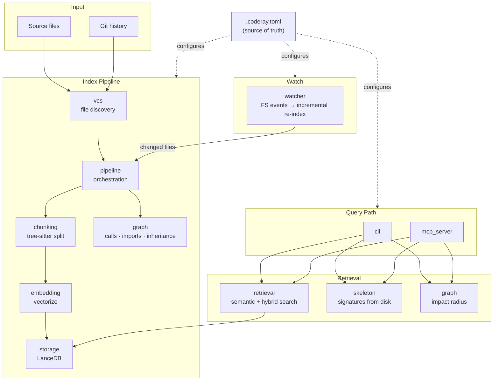

# Source Modules

## Architecture

**Config:** `.coderay.toml` is the single source of truth — it defines what to index, exclude, which embedding backend to use, search tuning, and watcher settings.

**Index path:** `vcs` discovers files and git history &rarr; `pipeline` orchestrates batched processing &rarr; `chunking` splits source via tree-sitter &rarr; `embedding` vectorizes chunks (fastembed CPU or MLX GPU) &rarr; `storage` writes vectors to LanceDB. `graph` builds the call/import/inheritance graph in parallel.

**Watch:** The file watcher monitors FS events and feeds changed files back into the pipeline for incremental re-indexing. Deleted or excluded files are automatically deindexed.

**Query path:** `cli` or `mcp_server` receives a request &rarr; `retrieval` embeds the query and searches the vector store (with optional hybrid/boosting) &rarr; `skeleton` extracts signatures directly from disk (no index needed) &rarr; `graph` traverses callers and dependents for impact analysis.

## Modules

| Module | Purpose |
| ------ | ------- |
| [chunking](coderay/chunking/README.md) | Tree-sitter parsing and semantic code chunking |
| [cli](coderay/cli/README.md) | Click-based command-line interface |
| [core](coderay/core/README.md) | Config, domain models, file locking, timing, utilities |
| [embedding](coderay/embedding/README.md) | Embedder abstraction (fastembed CPU; optional MLX on Apple Silicon) |
| [graph](coderay/graph/README.md) | Code relationship graph (calls, imports, inheritance) |
| [mcp_server](coderay/mcp_server/README.md) | MCP server for AI assistant integration |
| [pipeline](coderay/pipeline/README.md) | Index build/update orchestration and file watcher |
| [retrieval](coderay/retrieval/README.md) | Search orchestration and structural boosting |
| [skeleton](coderay/skeleton/README.md) | File skeleton extraction (signatures, no bodies) |
| [state](coderay/state/README.md) | Index metadata state machine and schema versioning |
| [storage](coderay/storage/README.md) | LanceDB vector store |
| [vcs](coderay/vcs/README.md) | Git integration (file discovery and change detection) |
